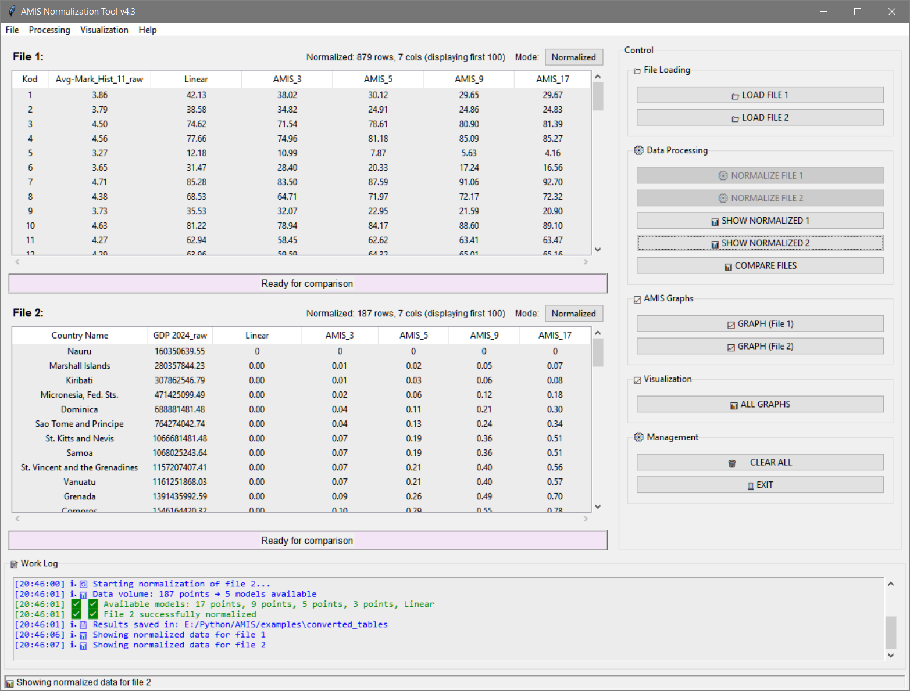
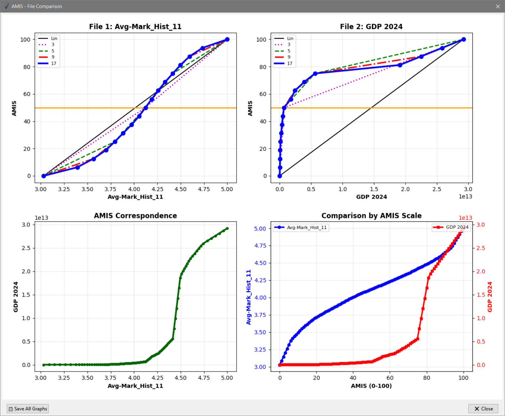

# AMIS: Python Package for Adaptive Multi-Interval Data Normalization and Mapping

A graphical application for **data normalization and mapping of heterogeneous data** using the **AMIS (Adaptive Multi-Interval Scale)** method.

## Features
- 📊 Universal normalization for homogeneous and heterogeneous data
- ⚡ **5 AMIS models** (3, 5, 9, 17 points + linear)
- 🎯 **Adaptive model selection** (NEW in v4.3) - automatically adjusts to data volume
- 🔄 **Cross-metric analysis** - compare different measurement units
- 📈 Interactive visualization and CSV export
- 🎯 Switch between original/normalized data views
- ✅ Input validation with clear error messages

## 🆕 Adaptive Model Selection

AMIS v4.3 automatically selects available normalization models:

- **10-19 points**: Linear + 3-point model
- **20-49 points**: + 5-point model  
- **50-99 points**: + 9-point model
- **100+ points**: All 5 models available

The interface adapts automatically - unavailable models are disabled in dialogs.

## Installation
**Prerequisites:** Python 3.8+ (pandas, numpy, scipy, matplotlib)
```
git clone https://github.com/Famimot/AMIS_Normalization_Tool
cd AMIS_Normalization_Tool
pip install -r requirements.txt
pip install -e .
```
## Quick Start

### 1. Installation

**From source (the package is currently under review for publication):**

```bash
# 1. Download the source code and navigate to the AMIS folder
# 2. Install the package and its dependencies
pip install -e .
```
Note: The pip install amis_tool command will become available after the package is published on PyPI.

### 2. Launching the Application

After installation, launch the graphical interface with the following command:

```bash
python -m amis_tool
```
Expected behavior: A splash screen will appear briefly, followed by the main application window.

## Input Data Format
The program requires data in **two-column format**:

```
Country,GDP
Japan,4026210821147
Germany,4659929336891
China,18743803170827
EU,19423000000000
United States,29184890000000
```
**Requirements:**
- **First column:** Labels/identifiers (country names, student IDs, item names)
- **Second column:** Numerical values to normalize (grades, GDP, scores, etc.)
- **Minimum:** 10 valid numerical values
- **Formats supported:** Excel (.xlsx, .xls) and CSV (.csv)

**Note:** The first column labels are preserved during normalization and appear in output tables.

| File | Format | Type | Size | Available Models* |
|------|--------|------|------|------------------|
| `World_Bank_Nominal_GDP_All_Countries_2024.xlsx` | Excel | Country GDP | 189 rows | All 5 models |
| `World_Bank_Nominal_GDP_87_Countries_2024.xlsx` | Excel | Country GDP | 87 rows | Linear, 3, 5, 9-point |
| `Student_Grades_History_Grade11_Raw_Data.xlsx` | Excel | Educational grades | 879 rows | All 5 models |
| `Student_Grades_History_Grade11_Raw_Data.csv` | CSV | Educational grades | 879 rows | All 5 models |

*Available models automatically adjust based on row count (10+ points required)

**Usage:** `python -m amis_tool` → **File** → **Open** → Select file → Choose data type according to table above.

## Screenshots


**Figure 1:** AMIS main interface showing simultaneous normalization of heterogeneous datasets: Russian school history grades (left panel) and World Bank GDP 2024 (right panel).



**Figure 2:** Four-panel comparative visualization:
- **Top-left:** AMIS normalization curve for history grades
- **Top-right:** AMIS normalization curve for country GDP  
- **Bottom-left:** Correspondence mapping between grade and GDP AMIS scales
- **Bottom-right:** Direct comparison of both metrics on unified 0-100 AMIS scale

## Project Structure

    AMIS/
    ├── amis_tool/                    # Main Python package
    │   ├── __init__.py
    │   ├── __main__.py              # Main entry point
    │   ├── core/
    │   │   └── amis_calculations.py
    │   ├── gui/
    │   │   ├── main_window.py
    │   │   ├── dialogs.py
    │   │   └── widgets.py
    │   └── utils/
    │       └── helpers.py
    ├── examples/                    # Example datasets
    │   ├── Student_Grades_History_Grade11_Raw_Data.xlsx
    │   ├── Student_Grades_History_Grade11_Raw_Data.csv
    │   ├── World_Bank_Nominal_GDP_All_Countries_2024.xlsx
    │   └── World_Bank_Nominal_GDP_87_Countries_2024.xlsx
    ├── images/                   # Application screenshots for documentation
    │   ├── screenshot-main.png
    │   └── screenshot-normalization-and-mapping.png
    ├── paper.md                     # JOSS article
    ├── paper.bib                    # Bibliography (with preprint)
    ├── setup.py                     # Installation configuration
    ├── requirements.txt             # Python dependencies
    ├── run_amis.py                  # Alternative launcher script
    ├── README.md                    # Documentation
    ├── LICENSE                      # MIT License
    ├── .gitignore                   # Git ignore rules
    └── .gitattributes               # Git attributes


## License
[MIT License](LICENSE)

## Citation
If you use AMIS in your research, please cite both the methodology paper and the software:

**Methodology Paper (APA):**  
Kravtsov, G. G. (2025, November 18). *Universal Adaptive Normalization Scale (AMIS): A methodology for integrating heterogeneous social and educational metrics*. https://doi.org/10.17605/OSF.IO/BDT2K [Preprint]

### Software Paper

[@kravtsov2025amis]
